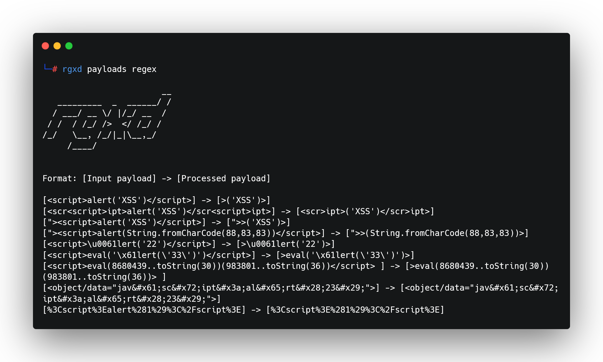

<h1 align="center">
  
 </h1>
<h3>This Golang security tool is designed to provide a unique perspective on how payloads mutate through custom regex patterns.</h3>
<h1 align="center">
  
 </h1>
 <br>
 <h2>Installation</h2>

```bash
go install -v github.com/DomenicoVeneziano/rgxd/cmd/rgxd@latest 
```
<br>
<h2>Key Features:</h2>
<ul>
<li><b>Regex Processing</b>: Quickly analyze how payloads evolve through regex transformations.</li>
<li><b>Efficiency</b>: Built in Golang for optimal performance and efficiency in processing large datasets.</li>
<li><b>Versatility</b>: Support for custom regex patterns and flexible payload input options.</li>
<li>I<b>nsightful Output</b>: Clearly displays the changes in payloads after undergoing regex processing.</li>
<li><b>Web Security Testing</b>: Ideal for both Red Teams and Blue Teams to test and secure web applications by understanding regex impact on input data.</li>
</ul>
